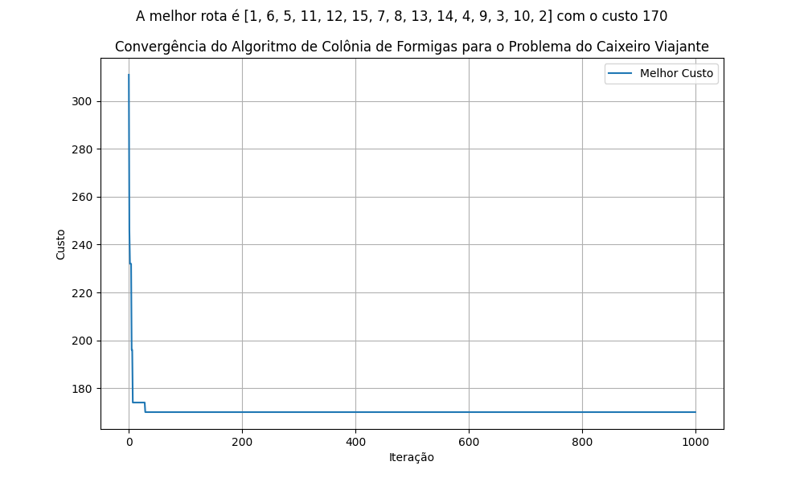
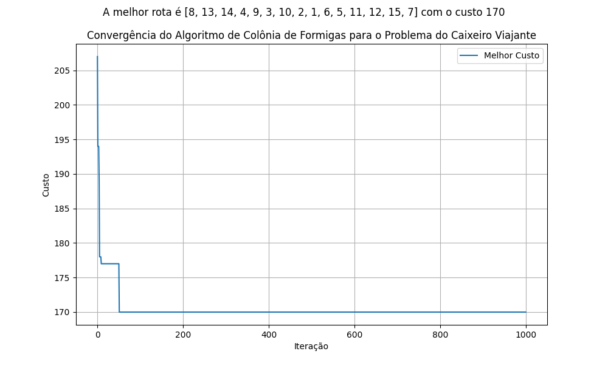

# Relatório Sobre a Convergência do Algoritmo Ant Colony Optimization (ACO)

## Introdução

O algoritmo **Ant Colony Optimization (ACO)** é inspirado no comportamento coletivo de colônias de formigas e utilizado para resolver problemas de otimização combinatória, como o problema do caixeiro viajante (TSP). Este relatório analisa a convergência do ACO em relação à matriz de distâncias fornecida, observando o comportamento dos custos ao longo das iterações.


## Parâmetros que serão modificados para avaliação

Os principais parâmetros do algoritmo são:
```
Número de formigas (N_FORMIGAS)
Peso do feromônio (ALPHA)
Peso da visibilidade (BETA)
Taxa de evaporação do feromônio (RHO)
Constante para depósito de feromônio (Q)
Máximo de iterações (MAX_ITERACOES)
```
Vamos variar **alfa** e **beta** e analisar o compotamento do algoritmo.

Os outros parâmetros foram mantidos padrões como:
```
N_FORMIGAS = 15 (Uma para cada cidade)
RHO = 0.5
Q = 100
MAX_ITERACOES = 1000
```

#### Sobre os Parâmetros:

1. **ALPHA (peso dos feromônios):**
   - Valores altos favorecem caminhos explorados anteriormente.
   - Valores baixos promovem maior exploração.

2. **BETA (peso da visibilidade):**
   - Valores altos priorizam rotas mais curtas imediatamente.
   - Valores baixos permitem mais diversidade na busca inicial.

#### Sobre as Fases:
- **Fase inicial:** O custo diminui rapidamente devido à exploração mais ampla do espaço de busca.
- **Fase intermediária:** A curva apresenta oscilações menores, com caminhos bons acumulando feromônio.
- **Fase final:** O custo estabiliza, indicando convergência do algoritmo para um caminho (ótimo local ou global).

#### Gráfico de Convergência

> Com alfa = 1.0 e beta = 1.0


> Com alfa = 1.0 e beta = 5.0


> Com alfa = 5.0 e beta = 1.0


### Conclusão

O ACO demonstrou eficiência na busca de soluções para o problema do TSP. O comportamento de convergência mostra que o algoritmo pode encontrar boas soluções em poucas iterações, desde que os parâmetros estejam bem ajustados. Ajustes nos pesos de feromônio, visibilidade e taxa de evaporação podem ser usados para melhorar ainda mais o desempenho.
