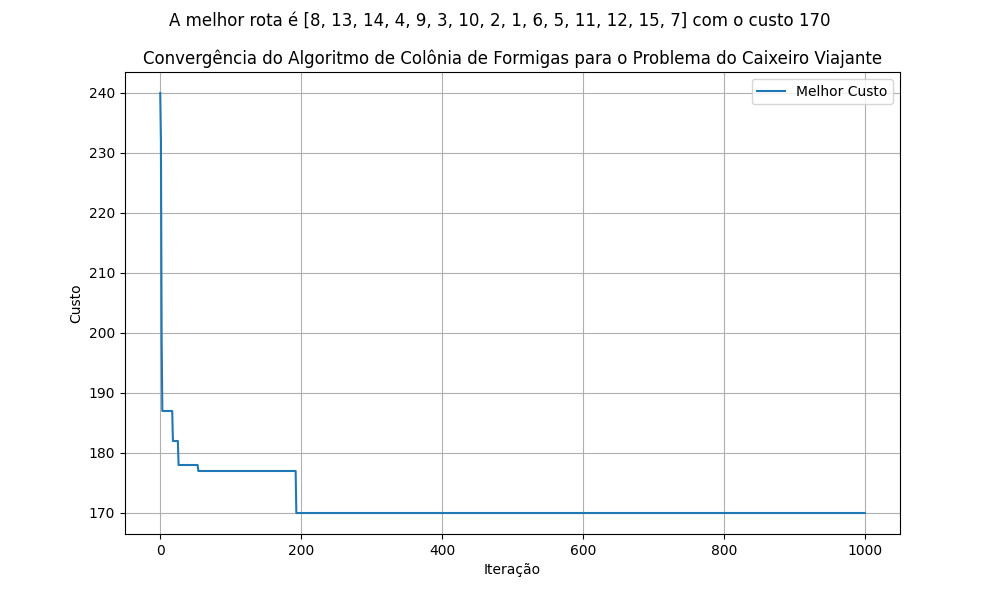

# Relatório Sobre a Convergência do Algoritmo Ant Colony Optimization (ACO)

## Introdução

O algoritmo **Ant Colony Optimization (ACO)** é inspirado no comportamento coletivo de colônias de formigas e utilizado para resolver problemas de otimização combinatória, como o problema do caixeiro viajante (TSP). Este relatório analisa a convergência do ACO em relação à matriz de distâncias fornecida, observando o comportamento dos custos ao longo das iterações.


## Parâmetros que serão modificados para avaliação

Os principais parâmetros do algoritmo são:
```
Número de formigas (N_FORMIGAS)
Peso do feromônio (ALPHA)
Peso da visibilidade (BETA)
Taxa de evaporação do feromônio (RHO)
Constante para depósito de feromônio (Q)
Máximo de iterações (MAX_ITERACOES)
```
Vamos variar **alfa** e **beta** e analisar o compotamento do algoritmo.

Os parâmetros padrões são:

```
N_FORMIGAS = 15
ALFA = 1.0
BETA = 2.0
RHO = 0.5
Q = 100
MAX_ITERACOES = 1000
```

#### Sobre os esperados para as fases:
- **Fase inicial:** O custo diminui rapidamente devido à exploração mais ampla do espaço de busca.
- **Fase intermediária:** A curva apresenta oscilações menores, com caminhos bons acumulando feromônio.
- **Fase final:** O custo estabiliza, indicando convergência do algoritmo para um caminho (ótimo local ou global).

#### Gráfico de Convergência

> Comportamento com os parâmetros padrão


#### Variando o número de formigas

> N_FORMIGAS = 10


> N_FORMIGAS = 100


Com 10 formigas, o algoritmo ACO tende a ser mais rápido (computacionalmente falando), mas a exploração é limitada, o que pode resultar em soluções de menor qualidade e uma convergência mais lenta.

Com 100 formigas, a exploração é maior, acelerando a convergência e aumentando a chance de encontrar uma solução melhor, mas com um custo computacional mais alto.

#### Variando o alfa

> ALFA = 0.5


> ALFA = 3.0


Com um valor alfa menor a taxa de exploção aumenta, o que é possível observar no gráfico. No caso particular testado, apesar de diminuir a influência do feromônio, ainda foi possível encontrar o menor tamanho do caminho que algoritmo consegue gerar (com base em várias execuções já feitas).

Aumentando o valor de alfa a exploração reduz, o algoritmo caminha a convergência mais rapidamente, porém encontra um resultado com custo menor que anterior.

#### Variando o beta

> BETA = 0.5


> BETA = 3.0


Diminuindo a influência do beta o algoritmo demora um pouco mais a convergir e gera uma busca com mais diversidade.

Aumentando o valor de beta, a busca explora melhores custos por visualiza os melhores caminhos.

> RHO = 0.1


> RHO = 1.0


Com um valor baixo de rho, o gráfico explora mais custo, mas ainda mantém uma convergencia rápida.

Com um valor alto, o feromonio demora mais para evaporar e favorece a convergencia rápida sem a exploração de mais custos. 

> Q = 10


> Q = 200


Uma menor taxa de deposito de feromonios favorece a exploração.

Uma taxa maior guia as formigas a estados melhores de maneira mais