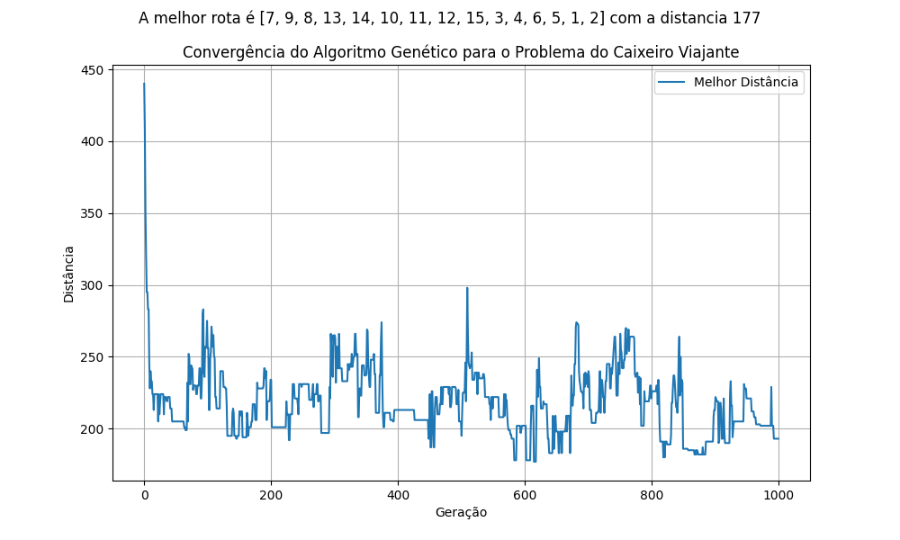

# Relatório Sobre a Convergência do Algoritmo Genético (AG)

## Introdução

O algoritmo **Genetic Algorithm (AG)** é um método de busca baseado em processos de seleção natural e evolução biológica, utilizado para resolver problemas de otimização. O AG trabalha com populações de soluções, selecionando, cruzando e mutando essas soluções para gerar novas populações até que uma solução ótima ou satisfatória seja encontrada. Este relatório analisa a convergência do AG em relação ao problema de otimização, observando o comportamento dos custos ao longo das iterações.

## Parâmetros que serão modificados para avaliação

Os principais parâmetros do algoritmo são:
```
Tamanho da população (TAM_POPULACAO)
Taxa de mutação (TX_MUTAÇÃO)
```

Os parâmetros padrões são:

```
TAM_POPULACAO = 100
NUM_GERACOES = 1000
TX_MUTACAO = 0.02
```

#### Gráfico de Convergência

> Comportamento com os parâmetros padrão  


#### Variando o tamanho da população

> TAM_POPULACAO = 20  


> TAM_POPULACAO = 200  


É notável a diferença entre os dois gráficos, com uma menor população o gráfico varia bastante duas soluções e não chega a um resultado bom como quando a população aumenta. Mas a principal diferença aqui está na convergência para a melhor rota encontrada. 

#### Variando a taxa de mutação

> TX_MUTACAO = 0.005  


> TX_MUTACAO = 0.1  


Com uma taxa baixa, o algoritmo tende a explorar soluções com mais cautela, convergindo lentamente, mas mantendo uma boa estabilidade nas gerações. Com uma taxa alta, o algoritmo explora mais agressivamente o espaço de soluções, o que pode aumentar a diversidade da população, mas também pode causar uma convergência mais instável e demorar mais para encontrar uma solução ótima.
